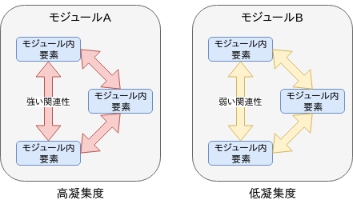
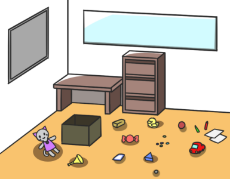
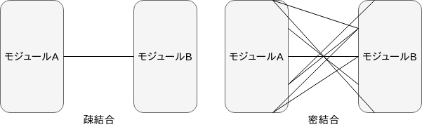
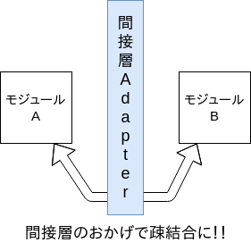
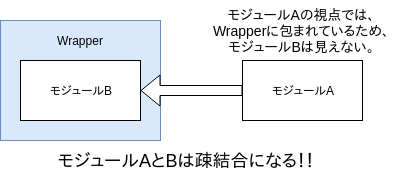

= 凝集度・結合度の直感的説明

== はじめに
このドキュメントでは「凝集度・結合度」の直感的な説明を行います。

== 凝集度
凝集度のイメージは、「モジュールの散らかり具合」 だと思っています。 例えば、凝集度が低いと、あるモジュール内に存在するモジュールの関連性が低くなります。

モジュール内に存在するモジュールの関連性が低くなりますと、関心のあるモジュールがどこに存在するのか記憶しにくくなります。(関連性が低いため)

このことは、モジュールだけではなく「部屋」等にもあてはまります。下図には、人形や紙やボールなどの関連性の低いものが散乱しています。しかし、散らかったものをボックスや棚に収納することによって、散らかり具合を緩和することができます。その結果、どこになにがあるのかを記憶することが容易になります。

== 結合度
結合度とは、モジュールが他のモジュールに対して、どれくらい依存しているのかというという解釈をしています。一言で言いますと「絡まり具合」です。複雑な依存関係をもったプログラムは、結合度が高く、「バラして組み直すこと」(保守)が困難です。

「凝集度が高いとモジュール内の結合度が高い」、「凝集度が低いとモジュール外のモジュールとの結合度が高い」という関係がしばしば成り立ちますので、両概念は密接な関係を持っております。なので、プログラムの実装や設計をする際は、両概念を一緒に考えます。

== 凝集度・結合度の適用例
設計指標として、凝集度・結合度は、どのように適用されるかを例示します。

ここでは、オブジェクト指向に関する概念を凝集度・結合度で考えてみたいと思います。

* 「カプセル化」 … カプセル化をすると、モジュール同士が互いに依存しないようになります。つまり、モジュール間の結合度が下がります。

* 「多態性」 … 実装の詳細を隠蔽し、異なるオブジェクトを同じように扱うことによって、多態性は実現されます。そのためには、具象クラスと 
抽象クラスの間で、適切な抽象化をする必要があります。以下に、
極端にダメな例を示します。
+
[source,java]
----
public class Main {
    public static void main(String[] args) throws Exception {
        new Dog().makeSound();
        new Cat().makeSound();
    }
}

class Animal{
    public void makeSound() throws Exception{
        if(this instanceof Dog){
            System.out.println("わんわん");
        }else if(this instanceof Cat){
            System.out.println("にゃーにゃー");
        }else{
            throw new Exception("Animalクラスを継承して良いのは、DogクラスとCatクラスのみです。");
        }
    }
}

class Dog extends Animal{}
class Cat extends Animal{}
----
+
上記のプログラムでは、Animalクラスが不必要にサブクラスの実装をしていおり、Animalクラスとサブクラスの結合度が高くなっています。これは、以下のように改善すべきです。
+
[source,java]
----
public class Main {
    public static void main(String[] args){
        new Dog().makeSound();
        new Cat().makeSound();
    }
}

interface Animal{
    void makeSound();
}

class Dog implements Animal{
    public void makeSound(){
        System.out.println("わんわん");
    }
}
class Cat implements Animal{
    public void makeSound(){
        System.out.println("にゃーにゃー");
    }
}
----
このようにサブクラスを抽象化すると高い凝集度が得られます。

* 「DI」 … DIを実現するためにはオブジェクトの生成と使用の責任を分離します。その結果は、生成と使用で各オブジェクトに任される責任は
１つになり、凝集度が上がります。

* 「Adapterパターン」 ... Adapterパターンとは、デザインパターンのひとつで、このパターンを適用することにより、互換性のないインターフェースをもつクラス同士を組み合わせることができます。Adapterを間接層として解釈すると、次のような図が描けます。
+

+
モジュールAとモジュールBが直接参照しなくなるため、疎結合になります。
その結果、例えば、いずれか一方のモジュールを取り替えたりすることが
できます。
+
また、「Adapterパターン」は「Wrapperパターン」という別名を持っています。「Wrapper」という言葉にこだわって、上図を書き直すと、次の図のような解釈ができます。
+

+
モジュールAの視点からすると、依存しているのは、Wrapperであり、
モジュールBではありません。つまり、モジュールBの実装は
隠蔽されており、両モジュールの関係性は疎結合になるのです。