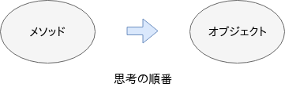
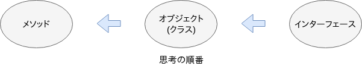
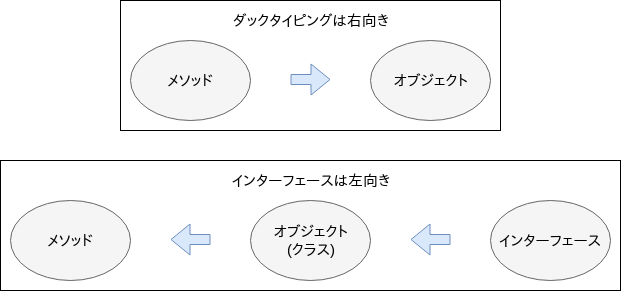

= ダックタイピングとインターフェースによる多態性の違い

== はじめに
「ダックタイピングとインターフェースによる多態性の違い」を私独自の解釈で説明します。

ダックタイピングとインターフェースは、どちらも多態性の実現方法として適用することができますが、両者の多態性の実現方法はどのように異なるのかについて論じたいと思います。

== ダックタイピング
ダックタイピングは次の諺に由来しています。
[quote, 'https://ja.wikipedia.org/wiki/%E3%83%80%E3%83%83%E3%82%AF%E3%83%BB%E3%82%BF%E3%82%A4%E3%83%94%E3%83%B3%E3%82%B0[Wikipedia:ダック・タイピング]']
____
If it walks like a duck and quacks like a duck, it must be a duck
____

この諺をプログラム風に解釈すると、「アヒルのように歩くメソッドとアヒルのように泣くメソッドをもつならば、それはアヒルオブジェクトである」となります。

つまり、プログラミングや設計を行っている時の頭の中には、メソッドのことを考え、その次にオブジェクトのことを考えるという順番があります。

== インターフェース
インターフェースで多態性を実現しようとすると、まず、インターフェースを作成する必要があります。

[source, java]
----
interface DuckInterface{
    void walk();
    void quack();
}
----

つぎに、DuckInterfaceを実装したクラスを作成します。

[source, java]
----
class Duck implements DuckInterface{
    public void walk(){
        System.out.println("アヒルのように歩く");
    }
    public void quack(){
        System.out.println("アヒルのように泣く");
    }
}
----

実際にDuckクラスを使用すると、次のようになります。

[source, java]
----
DuckInterface duck = new Duck();
duck.walk();
duck.quack();
----

このとき、おそらく、頭の中では以下のような手順の思考をしたはずです。

1. Duckクラスをインスタンス化する
2. DuckクラスはDuckInterfaceを実装している
3. DuckInterfaceはwalkメソッドとquackメソッドを持っている

この思考の流れを図示しますと、以下のようになります。

== 両者の違い
両者の実現方法の違いは、思考の流れです。図示すると明らかですが、
思考の流れが180度異なります。

